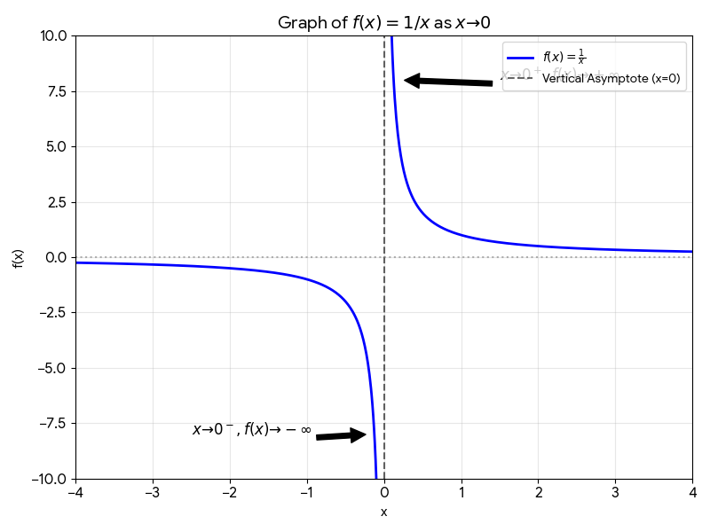
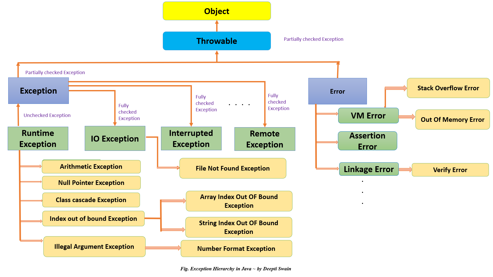
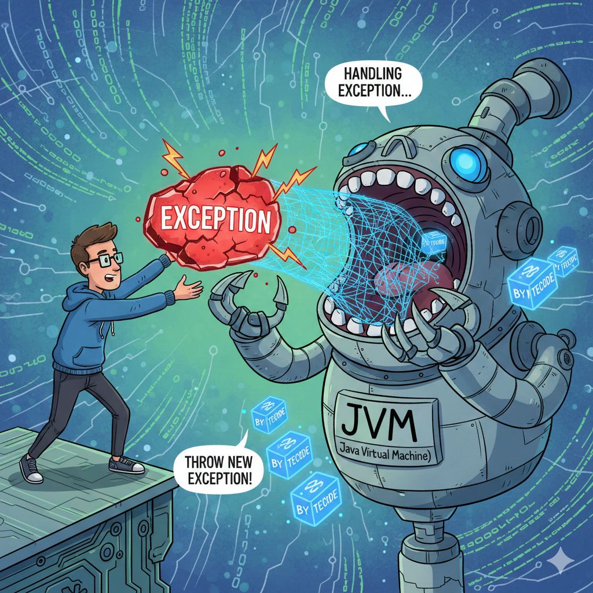

# Exception Handling

### 1. What is the output of the following code?
```java
class Test {
    public static void main(String[] args) {
        System.out.println(10/3);
    }
}
```

### Options:
- 3.34
- 3.3
- 3
- 1

### 2. What is the output of the following code?
```java
class Test {
    public static void main(String[] args) {
        System.out.println(10/0);
    }
}
```

### 3. What is the output of the following code?
```java
class Test {
    public static void main(String[] args) {
        System.out.println(10.0/0);
    }
}
```



### 4. What is the output of the following code?
```java
class Test {
    public static void main(String[] args) {
        System.out.println(10/-0.0);
    }
}
```

### 5. What is the output of the following code?
```java
class Test {
    public static void main(String[] args) {
        m1();
    }

    public void m1() {
        m2();
    }

    public void m2() {
        System.out.println(10/0);
    }
}
```

### 6. What is the output of the following code?
```java
class Test {
    public static void main(String[] args) {
        m1();
    }

    public static void m1() {
        m2();
    }

    public static void m2() {
        System.out.println(10/0);
    }
}
```

```bash
Exception in thread "main" java.lang.ArithmeticException: / by zero
        at Test.m2(test.java:11)
        at Test.m1(test.java:7)
        at Test.main(test.java:3)
```


### 7. What is the output of the following code?
```java
class Test {
    public static void main(String[] args) {
        m1();
        System.out.println(10/0);
    }

    public static void m1() {
        m2();
        System.out.println("In m1");
    }

    public static void m2() {
        System.out.println("In m2");
    }
}
```

## Interview Question: What is the difference between Exception and Error?

### Error
It represents a problem at the system level or within the Java Virtual Machine (JVM) environment (e.g., running out of memory, stack overflow, system incompatibility).

### Exception
It represents a problem that is primarily caused by the application itself or the user's interaction with it (e.g., inputting bad data, missing files, logic errors).




## Interview Question: What is the difference between Checked and Unchecked exception?

```bash
The exception which are checked by compiler for smooth execution of program at runtime, this exceptions are called as checked exception
```

```java
import java.io.PrintWriter;

class Test {
    public static void main(String[] args) {
        PrintWriter pw = new PrintWriter("musk.txt");
        pw.println("Elon Musk is a business magnate.");
    }
}
```

<details>
  <summary>Output</summary>

    test.java:5: error: unreported exception FileNotFoundException; must be caught or declared to be thrown
            PrintWriter pw = new PrintWriter("musk.txt");
                            ^
    1 error
</details>

```bash
The exception which are not checked by compiler for smooth execution of program at runtime, this exceptions are called as checked exception
```

```java
import java.io.*;

class Test {
    public static void main(String[] args) throws FileNotFoundException{
        PrintWriter pw = new PrintWriter("musk.txt");
        pw.println("Elon Musk is a business magnate.");
        pw.close();
    }
}
```

### What is the output?

```java
import java.io.*;

class Test {
    public static void main(String[] args) throws FileNotFoundException{
        PrintWriter pw = new PrintWriter("musk.txt");
        System.out.println(10/0);
    }
}
```

### Interview Question: Which exceptions is occurs at compile time?

### Note:
```bash
Runtime exception and its child classes, error and its child classes are unchecked exceptions except these remaining are checked exceptions 
```

```java

class Test {
    public static void main(String[] args) {
        try {
            System.out.println(10/0);
        }
        catch(ArithmeticException e) {
            e.printStackTrace();
            System.out.println(e);
            System.out.println(e.getMessage());
        }
    }
}
```

<details>
    <summary>Output: </summary>

    java.lang.ArithmeticException: / by zero
        at Test.main(test.java:5)
    java.lang.ArithmeticException: / by zero
    / by zero
</details>


### What is the output?

```java

class Test {
    public static void main(String[] args) {
        try {
            System.out.println(10/0);
        }
        catch(Exception e) {
            System.out.println("Exception");
        }
        catch(ArithmeticException e) {
            System.out.println("Arithmetic Exception");
        }
        
    }
}
```

<details>
    <summary>Output: </summary>

    test.java:10: error: exception ArithmeticException has already been caught
        catch(ArithmeticException e) {
        ^
    1 error
</details>

### Interview Question: Difference between final, finally, finalize()


------------------------------

### Explain throw and throws

```java
class Test {
    public static void main(String[] args) {
        System.out.println(10/0);
    }
}
```



```java
class Test {
    public static void main(String[] args) {
        throw new ArithmeticException("/ by zero");
    }
}
```

```java
class Test {
    static ArithmeticException e = new ArithmeticException("/ by zero");
    public static void main(String[] args) {
        throw e;
    }
}
```


<details>
    <summary>Output: </summary>

    Exception in thread "main" java.lang.ArithmeticException: / by zero
        at Test.<clinit>(test.java:2)
</details>

```java
class Test {
    static ArithmeticException e;
    public static void main(String[] args) {
        throw e;
    }
}
```

<details>
    <summary>Output: </summary>

    Exception in thread "main" java.lang.NullPointerException
        at Test.main(test.java:4)
</details>


```java
class Test {
    public static void main(String[] args) {
        System.out.println(10/0);
        System.out.println("elon");
    }
}
```


```java
class Test {
    public static void main(String[] args) {
        throw new ArithmeticException("/ by zero");
        System.out.println("elon");
    }
}
```

```java
class Elon {
    public static void main(String[] args) {
        throw new Elon();
    }
}
```

```java
class Elon extends RuntimeException {
    public static void main(String[] args) {
        throw new Elon();
    }
}
```

```java
import java.io.PrintWriter;

class Elon {
    public static void main(String[] args) {
        exploreMars();
    }

    public static void exploreMars() {
        colonizeMars();
    }

    public static void colonizeMars() {
        PrintWriter writer = new PrintWriter("peter_thiel.txt");
        writer.println("Colonizing Mars...");
        writer.close();
    }
}
```


```java
import java.io.PrintWriter;

class Elon {
    public static void main(String[] args) {
        exploreMars();
    }

    public static void exploreMars() {
        colonizeMars();
    }

    public static void colonizeMars() throws java.io.FileNotFoundException {
        PrintWriter writer = new PrintWriter("peter_thiel.txt");
        writer.println("Colonizing Mars...");
        writer.close();
    }
}
```

### Will this code compile?

```java
class Elon {
    public static void main(String[] args) {
        throw new Exception("This is an exception");
    }
}
```

```java

class Elon {
    public static void main(String[] args) {
        throw new Error("This is an exception");
    }
}
```

```java
class Elon {
    public static void main(String[] args) {
        try {
            System.out.println("Hello, Elon!");
        } catch (Exception e) {
            // code
        }
    }
}
```

```java
class Elon {
    public static void main(String[] args) {
        try {
            System.out.println("Hello, Abhishek!");
        } catch (Error e) {
            // code
        }
    }
}
```

### You have 5-10 minutes, use ChatGPT or Gemini and write a code which throw customized exception. If user has experience 0-2 then raise exception saying PrettyLittleBaby and if more than 2 then no worries print anything.

```java
// Custom Exception
class PrettyLittleBabyException extends Exception {
    PrettyLittleBabyException(String message) {
        super(message);
    }
}

public class Test {
    public static void main(String[] args) {

        int experience = 2; // change value to test

        try {
            if (experience >= 0 && experience <= 2) {
                throw new PrettyLittleBabyException("PrettyLittleBaby: Experience too low!");
            }

            System.out.println("Great! You have good enough experience.");

        } catch (PrettyLittleBabyException e) {
            System.out.println(e.getMessage());
        }
    }
}
```