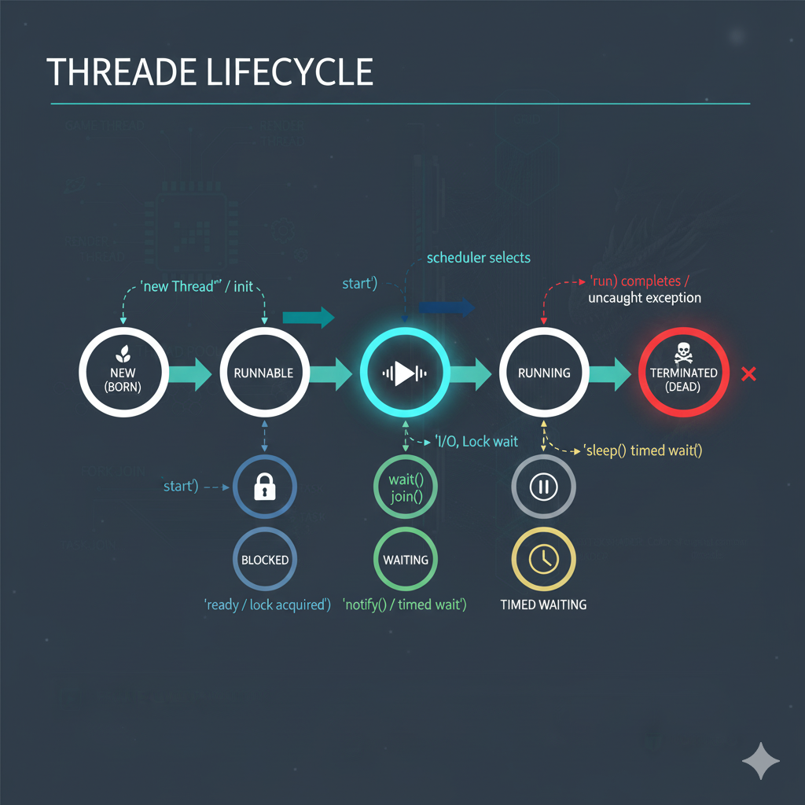

# Interview Questions:

## 1. What is multitasking

## 2. What is Process and Thread

## 3. In how many ways thread can be defined

- extends thread class
- implement runnable interface

```java
class Test extends Thread {
    void run() {
        // work of the thread
    }
}
```

### Any issue in above code?

```java
class MyThread extends Thread {
    public void run() {
        for (int i = 1; i <= 10; i++) {
            System.out.println("Thread is running: " + i);
        }
    }
}

class Test {
    public static void main(String[] args) {
        MyThread t1 = new MyThread();
        t1.run();
        for (int i = 1; i <= 10; i++) {
            System.out.println("Main thread: " + i);
        }
    }
}
```


```java
class MyThread extends Thread {
    public void run() {
        for (int i = 1; i <= 10; i++) {
            System.out.println("Thread is running: " + i);
        }
    }
}

class Test {
    public static void main(String[] args) {
        MyThread t1 = new MyThread();
        t1.start();
        for (int i = 1; i <= 10; i++) {
            System.out.println("Main thread: " + i);
        }
    }
}
```

```java
class MyThread extends Thread {
    public void run() {
        System.out.println("Thread 1");
    }
    public void run(int x) {
        System.out.println("Thread 2");
    }
}

class Test {
    public static void main(String[] args) {
        MyThread t1 = new MyThread();
        t1.start();
    }
}
```

## Is this code is valid or not?

```java
class MyThread extends Thread {
    
}

class Test {
    public static void main(String[] args) {
        MyThread t1 = new MyThread();
        t1.start();
    }
}
```

```java
class MyThread extends Thread {
    public void start() {
        for (int i = 0; i < 5; i++) {
            System.out.println("Thread running: " + i);
        }
    }
}

class Test {
    public static void main(String[] args) {
        MyThread t1 = new MyThread();
        t1.start();
        for (int i = 0; i < 5; i++) {
            System.out.println("Main thread: " + i);
        }
    }
}
```

```java
class MyThread extends Thread {
    public void start() {
        super.start();
        System.out.println("Start method called");
    }
    public void run() {
        for (int i = 0; i < 10; i++) {
            System.out.println("MyThread: " + i);
        }
    }
}

class Test {
    public static void main(String[] args) {
        MyThread t1 = new MyThread();
        t1.start();
        for (int i = 0; i < 10; i++) {
            System.out.println("Main thread: " + i);
        }
    }
}
```

# Human lifecycle


# Thread lifecycle



```java
class MyThread extends Thread {
    public void run() {
        System.out.println("Thread is running");
    }
}

class Test {
    public static void main(String[] args) {
        MyThread t1 = new MyThread();
        t1.start();
        t1.start();
    }
}
```

## WE ONLY HAVE ONE LIFE, SO WE DON"T HAVE CHANCE TO LIVE AGAIN

## Create Thread using Runnable Interface

### I don't know about Runnable, go and check in API Docs

```java
class MyThread implements Runnable {
    public void run() {
        for (int i = 0; i < 100; i++){
            System.out.println("Thread is running");
        }
    }
}

class Test {
    public static void main(String[] args) {
        MyThread myThread = new MyThread();
        Thread thread = new Thread(myThread);
        thread.start();
        for (int i = 0; i < 100; i++){
            System.out.println("Main thread is running");
        }
    }
}
```

```java
class MyThread implements Runnable {
    public void run() {
        for (int i = 0; i < 100; i++){
            System.out.println("Thread is running");
        }
    }
}

class Test {
    public static void main(String[] args) {
        MyThread myThread = new MyThread();
        Thread thread = new Thread(myThread);
        myThread.start();
    }
}
```