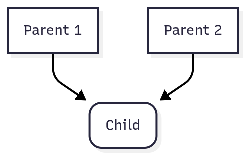
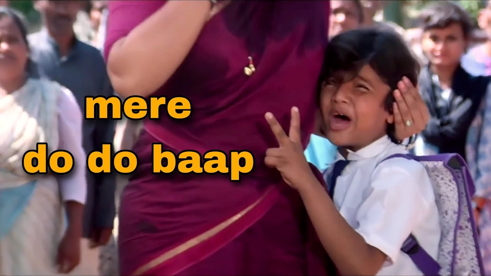

## 1. Choose the correct option

```java
class Test {
    public static void main(String[] args) {
        for (;;) {
            System.out.println("Hello, World!");
        }
    }
}
``` 

## Options:

1. "Hello, World!" is printed only once
2. No output is printed
3. "Hello, World!" prints infinitely
4. Compilation error

## 2. When we create child class object, parent class object is created or not? Give me proof

## Options

1. Yes
2. No

## 3. What is the output of this code?

```java
class Test {
    String name = "AbhishekASLK";
    Test(){
        System.out.println(name);
    }
    public static void main(String[] args) {
        Test t = new Test();
    }
}
```

## Options

1. AbhishekASLK
2. Compiler time Error
3. Runtime Error
4. Mujhe kya pata


## 4. What is the output of this code?

```java
class Test {
    String name;
    int age;
    Test(){
        System.out.println(name);
        System.out.println(age);
    }
    public static void main(String[] args) {
        Test t = new Test();
    }
}
```

## 5. What is the output of the below code?

```java
class Test {
    Test(){
        System.out.println(this);
    }
    public static void main(String[] args) {
        Test t = new Test();
    }
}
```

## Answers:
### 2.
```java
class Parent {
    Parent(){
        System.out.println(this.hashCode());
    }
}

class Child extends Parent {
    Child(){
        System.out.println(this.hashCode());
    }
}

public class Main
{
	public static void main(String[] args) {
	    Child c = new Child();
	    System.out.println(c.hashCode());	
	}
}
```

# 1. INHERITENCE

```java
class Parent {
    void m1(){
        System.out.println("m1");
    }  
}

class Child extends Parent {
    void m2(){
        System.out.println("m2");
    }
}

class Main {
    public static void main(String[] args){
        // 1.
        Child c = new Child();
        c.m1();
        c.m2();

        // 2.
        Parent p1 = new Parent();
        p1.m1();
        p1.m2();

        // 3.
        Parent p2 = new Child();
        p2.m1();
        p2.m2();

        // 4.
        Child c2 = new Parent();
        c2.m1();
        c2.m2();

        // reference means pointing to that object
    }
}
```

## Types of Inheritance

1. 
2. 
3. 
4.
5.
6.

```java
class A {
    void m1(){
        System.out.println("m1");
    }  
}

class B {
    void m2(){
        System.out.println("m2");
    }
}

class C extends A, B {

}
```

### How interface overcome this problem?

```java
interface A {
    void m1();
}

interface B {
    void m1();
}

class C implements A, B {

    void m1() {
        System.out.println("Implementation of m1");
    }
    public static void main(String[] args) {
        C obj = new C();
        obj.m1();
    }
}
```

# Do you think, above code will work?

# Lets see how Python fix this?



```python

class A:
    def m1(self):
        print("A: m1")

class B:
    def m1(self):
        print("B: m1")

class C(A, B):
    pass 

c = C()
c.m1()
```

## Q. will this work?

```java
class A extends A {

}
```

```java
class A extends B {
    
}

class B extends A {

}
```

## Q. Every class has Object as a Parent


```java
class A {

}

class B extends A {

}
```




# super and this keywords

## 1. 
```java
class Elon {
    Elon (){
        System.out.println("constructor");
        super();
    }
}
```

## 2.
```java
class Elon {
    Elon (){
        super();
        this();
        System.out.println("constructor");
    }
}
```

## 3. 

```java
class Zuck {
    public void m1(){
        super();
        System.out.println("method");
    }
}
```

```java
class Parent {
    int x = 10;
}

class Child extends Parent {
    int x = 20;

    void showValues(int x) {
        System.out.println(x); 
        System.out.println(this.x); 
        System.out.println(super.x); 
    }
}

public class Main {
    public static void main(String[] args) {
        Child obj = new Child();
        obj.showValues(30); 
    }
}
```

## What is difference between super,this and super(), this()?
